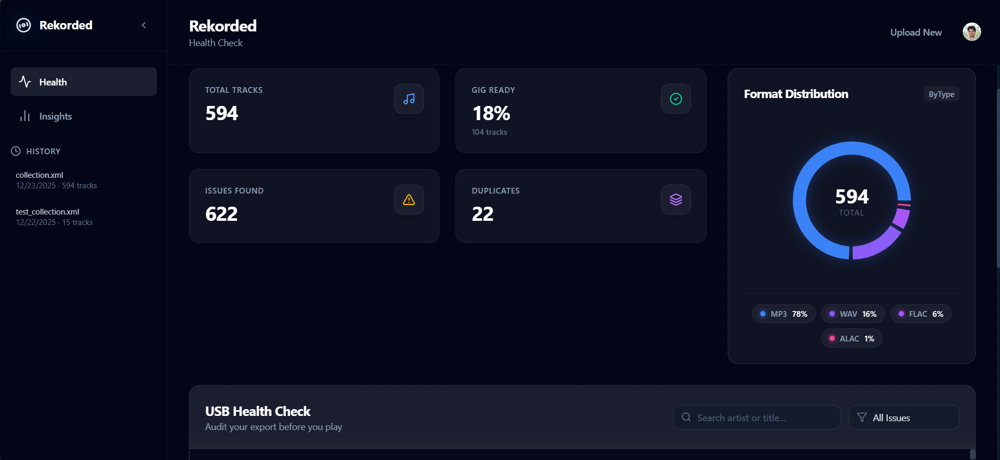

# Rekorded 💽

> **The ultimate health check for your Rekordbox USB exports.**

Rekorded is a modern web application designed for DJs to instantly audit their music library. Drag and drop your `collection.xml` to find low-bitrate tracks, missing cues, and other gig-breaking issues before you step on stage.

## 🚀 Features

-   **Instant Health Audit**: Automatically flag tracks with low bitrates (< 320kbps), missing hot cues, or broken file paths.
-   **Library Visualizations**: Interactive charts showing your library's format distribution (MP3 vs AIFF vs WAV), genre breakdown, and key analysis.
-   **Gig-Readiness Score**: Get a "Gig Ready" percentage to know how prepared your USB really is.
-   **Secure & Private**: Your library data is processed securely. We only store metadata to show your history; your actual music files never leave your drive.

## ⚡ Quick Start (Demo)

Want to see it in action without exporting your entire library?

1.  Download the sample file: [**demo_collection.xml**](./demo_collection.xml)
2.  Go to [Rekorded](https://rekorded.vercel.app).
3.  Drag and drop the file into the upload zone.
4.  Explore the insights!

## 🛠️ Tech Stack

-   **Frontend**: Next.js 15 (App Router), React 19, Tailwind CSS 4, Framer Motion, Recharts.
-   **Backend**: Python (FastAPI), SQLAlchemy, Supabase (PostgreSQL).
-   **Authentication**: Clerk.
-   **Deployment**: Vercel (Frontend + Serverless Backend).

## 📄 License

MIT © [Gautam](https://github.com/gautamrn)
